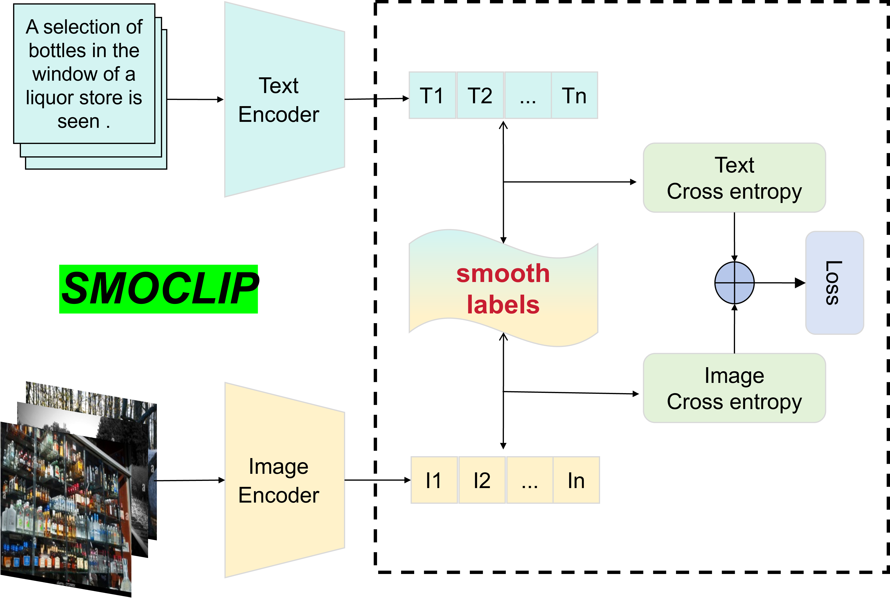

# SMOCLIP
Contrastive Language-Image Pretraining (CLIP)
models demnstrate the powerful ability in order to maximize
the mutual information between textual and visual modalities
to learn representations. However, the neural network push
itself to learn in the direction where the difference between the
correct and incorrect labels is largest, which leads to network
overfitting when there is less training data and is not enough to
characterize all the sample features. Thus, we propose SMOCLIP
which smooths the labels for contrastive loss to train CLIP. This
is a regularization strategy, which mainly adds noise through
soft one-hot, which reduces the weight of the class of the real
sample label in the calculation of the loss function, and finally
suppresses the overfitting. When applied to existing datasets such
as CC3M and CC12M, our method enhances the generalization
capabilities of CLIP and improve the zero-shot classification
accuracy over the benchmark on an equal computational budget.
We also demonstrate that it is possible to enhance the model
comprehension ability when ensembling various models.
| Model    | Training data |  ImageNet zero-shot acc. | 
| -------- | ------- |  ------- | 
| ViT-B/32  | CC3M  |  40.91% |
| ResNet50  | CC3M  |  32.55% |
| ViT-B/32 | CC12M | 45.15% |
| ResNet50 | CC12M | 49.91% |
|
## Approach
